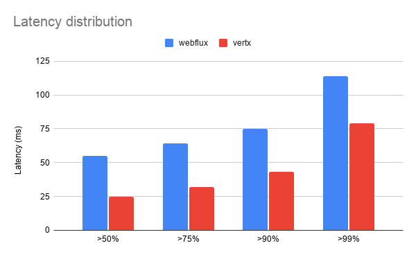

# Benchmark Vertx & WebFlux

- Intel(R) Core(TM) i7-9700K CPU @ 3.60GHz
- CentOS 7
- java 8
- Benchmark tool: wrk
- Command: `wrk -t6 -c120 -d40s --latency some-host/api/transactions`

|         | Throughput (requests/s) |
|---------|-------------------------|
| Vertx   | 3131.68 (x1.5 higher)   |
| WebFlux | 2100.06                 |

